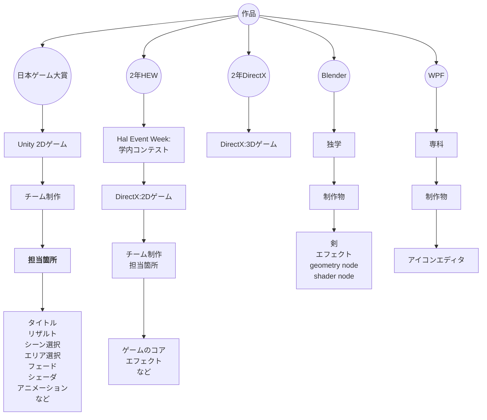

# ForEntrySheets_yuta6686
-------------------------------------------------------------------------------------------------------------------------------
# 構成

-------------------------------------------------------------------------------------------------------------------------------

## 日本ゲーム大賞作品

### タイトル「***HopSlime***」

### 詳細情報

#### 期間
- 2022年3月1日～5月31日

#### チーム制作
- 人数：10人（プログラマ6名,プランナー1名,デザイナー3名)

#### どんなゲーム？

#### 担当箇所

- シーン
	- タイトルシーン
	- エリア選択シーン
	- ステージ選択シーン
	- リザルトシーン

- ゲーム
	- ギミック一部
	- ゴール演出

- その他
	- エフェクト
	- シェーダグラフによる特殊表現

#### こだわった点
- コインエフェクト
	- 種類を増やすことで、より見栄えをよくしようとした。
- スライムの反発エフェクト
	- シェーダグラフとうまく組み合わせて、作成した。
- タイトル、ゴール、選択シーンのアニメーション
	- UnityのAnimationを使用してキーフレームでのアニメーション制作をしました。
	
### スクリーンショット

-------------------------------------------------------------------------------------------------------------------------------

## Hal Event Week（学内コンテスト) ：スクリーンショット

### タイトル「***ぶっ飛べっ!!ナットウ・トライアル***」

### 詳細情報

#### 期間
 - 2021年10月8日 ~ 2022年1月31日
 
 #### チーム制作
 - 人数：7人(プログラマ4人,プランナー1人,デザイナー2人)
 
 #### どんなゲーム？

#### 担当箇所
- ゲームシーン
	- プレイヤーの挙動
	- 糸の挙動		
- エフェクト
	- アイテム
	- 時間遅延演出

#### こだわった点
- ジャンプ中のエフェクト
	- 最後まで飛ぶと風エフェクトがでる。
- ワイヤーアクション
	- 振り子みたいな動きと、直線的な動きを使い分けられるように工夫しました。
	- (反省)ワイヤーを曲線で表現する。

-------------------------------------------------------------------------------------------------------------------------------

## 2年DirectX 学内コンテスト：スクリーンショット

-------------------------------------------------------------------------------------------------------------------------------

## Blender作品

### 詳細情報
- 独学
- 2020年6月からYoutubeのチュートリアルを見ながら始める。
- 武器・エフェクトなどを制作
- Geometry Node でモデリング勉強中
- Shader Node でシェーダを研究中

### 武器など

### エフェクトなど

-------------------------------------------------------------------------------------------------------------------------------

## WPF

### このアイコンエディタでできること

- 32ビットのビットマップ画像を開く
- 保存する
- 拡大・縮小
- Redo・Undo
- カラーパレットで色変更

-------------------------------------------------------------------------------------------------------------------------------

