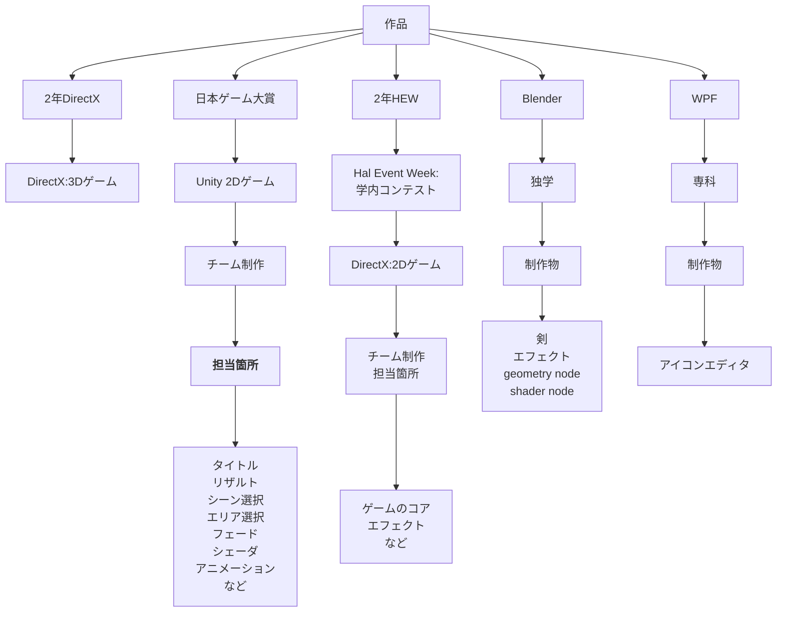

# ForEntrySheets_yuta6686
# 構成

```mermaid
graph TB
	all[作品]
	dx2[2年DirectX]
	hew2[2年HEW]
	ngt[日本ゲーム大賞]
	bld[Blender]
	wpf[WPF]

	all --> ngt
	all --> hew2
	all --> dx2	
	all --> bld
	all --> wpf

	dx2 --> dx2_sum1[DirectX:3Dゲーム]
	hew2 --> hew2_sum1[Hal Event Week:</br>学内コンテスト]-->hew2_sum2[DirectX:2Dゲーム]
	--> hew2_sum3[チーム制作<br>担当箇所]
	--> hew2_sum4[ゲームのコア<br>エフェクト<br>など]
	ngt --> ngt_sum1[Unity 2Dゲーム] --> 
	ntg_sum1[チーム制作<br>]-->ntg_sum2.5[<b>担当箇所</b>]-->
	ngt_sum2[タイトル<br>リザルト<br>シーン選択<br>エリア選択<br>フェード<br>シェーダ<br>アニメーション<br>など]
	bld-->bld_sum1[独学]-->bld_sum2[制作物]-->
	bld_sum3[剣 </br>エフェクト </br>geometry node </br>shader node]
	wpf-->wpf_sum1[専科]-->wpf_sum2[制作物]-->wpf_sum3[アイコンエディタ]
	
```

## 日本ゲーム大賞作品：スクリーンショット

## Hal Event Week（学内コンテスト) ：スクリーンショット

